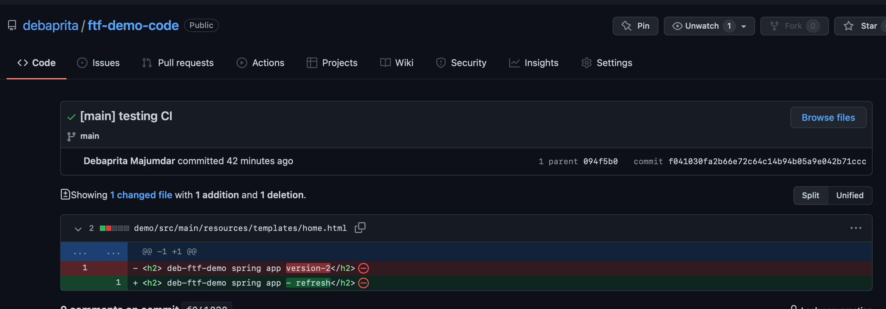
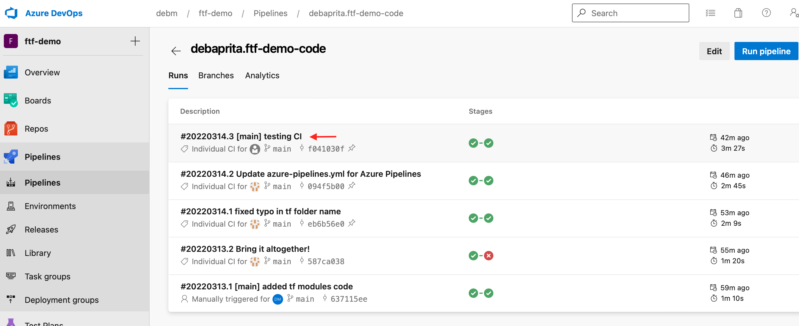
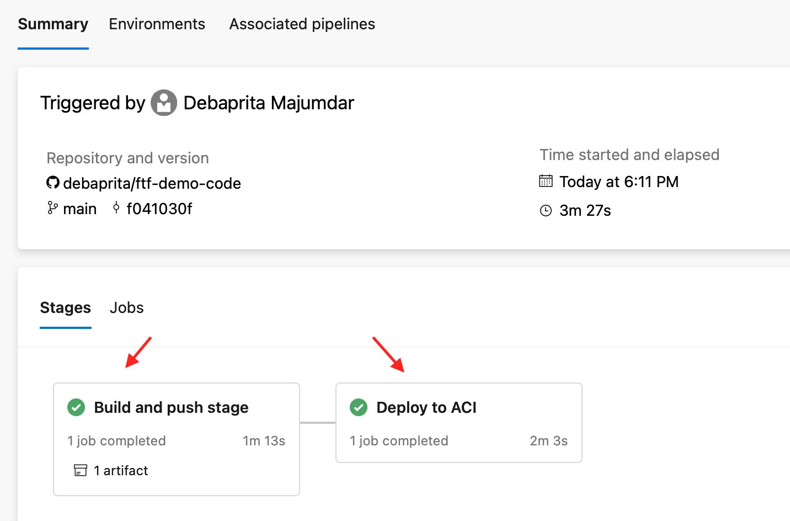
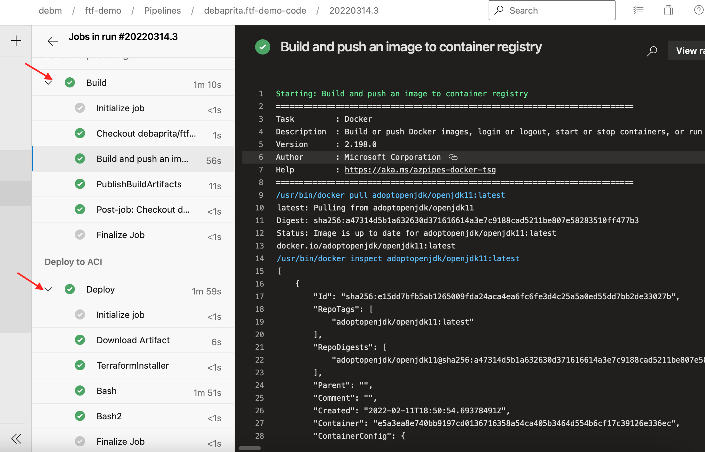

<!-- MarkdownTOC autolink="true" -->

- [About The Project](#about)
- [Installation](#install)
- [Sample Run](#run)

<!-- /MarkdownTOC -->

---

# About The Project

This repo solves for an end-to-end CI scenario where the source code, a spring boot app displaying a static site (through Thymleaf) gets built and deployed to an Azure Container Group Instance(ACI). The pieces of the puzzle rely in connecting essentially three cloud providers -

* GitHub (stores app and infra as IAC code)
* Azure DevOps (PaaS pipelines)
* Slack (notification platform)

Commits to repo's main branch triggers the Azure DevOps pipeline which checkouts the repo, builds and pushes to a private Azure Container Registry(ACR) using multi-stage Docker build and then uses Terraform code to build an ACI instance to pull and run the image from ACR.

# Installation

Following sections lists the steps you would need to execute to set this up in your subscriptions!

## Slack 

Create a Slack app, add it to a workspace, and generates its webhook.

## Azure DevOps

This project uses self-hosted agents to build Azure pipelines, and the following details are necessary before running the Terraform code to create them automatically -

* Azure DevOps PAT - having access to run and manage pipelines
* Azure DevOps Org URL
* Azure DevOps Project Agent Pool names to which these agents ae to be added.

Clone Terraform [repo](git@github.com:debaprita/ftf-demo-infra.git) and create the key-vault from under tf/q2/self-hosted-agent/keyvault. Enter the above values by creating 3 new secrets az-devops-agent-pool,az-devops-url and pat.

To create the self hosted agent, create networking tf/q2/self-hosted-agent/network, and then the vm itself tf/q2/self-hosted-agent/vm. For now the identity isn't used.

Create an Azure pipeline secret variable to store your Slack API token for the webhook calls.

## Pipeline Run

Before running the pipeline process, create the acr instance tf/q2/acr - and make sure Azure pipeline app has access to the code repository.

# Sample Run

Once the changes are made to GitHub repo, 

ADO job gets triggered,

job runs as mutlistage Build & Deploy, 

each stage has multiple tasks to it,
